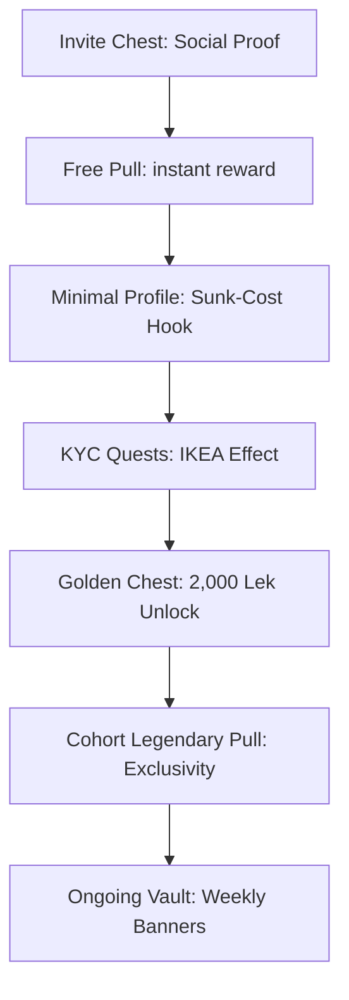

# Raiffeisen Youth — Pitch Narrative & Core Strategic Insights
**Challenge Brief:** "Play, Invite, Belong" (Target: 18–25 year olds in Albania)
**Concept Title:** "Your first pull is waiting."

---

## 1. The Core Innovation: Repackaging the 2,000 Lek Welcome Bonus

### The Problem with Traditional Signups
Raiffeisen Bank already spends a marketing budget of **2,000 Lek** as a sign-up bonus for new Youth accounts. In the standard digital flow, this reward is announced via a boring text message or a static account balance update:
`Your balance has been updated: +2,000 ALL`.
*   **Zero emotional peaks:** It feels like a utility payment, not a gift.
*   **No user engagement:** It is instantly spent or forgotten, yielding low retention.
*   **Poor acquisition power:** Word of mouth is weak because there's nothing visually interesting to share.

### The Gacha Solution: Repackaging (Not Reinventing)
We wrap this existing **2,000 Lek** budget into the **same Gacha Chest Pull mechanic** that runs throughout the application. 
*   **High Emotional Impact:** When the user completes the KYC steps, they don't get a balance update. Instead, they unlock the **Golden Chest**. Opening the chest reveals the 2,000 Lek reward alongside card skins, borders, or theme cosmetics.
*   **Variable Reward Framing:** By combining the real cash bonus with visual collectibles in a single high-fidelity opening animation, we amplify the perceived value of the 2,000 Lek by **10x**.

---

## 2. Onboarding Mechanics & "Sunk Cost" Hook

Our onboarding flow reverses the standard friction funnel. We introduce gamification BEFORE asking for personal information:

### Key Phases:
1.  **Sunk-Cost Hook (Step 1):** The user gets their first pull *before* filling out any forms. By giving them a reward immediately (e.g. Navy Card Skin), they feel invested. Giving up on onboarding now means throwing away a reward they already "own."
2.  **IKEA Effect (Step 3):** The 5 KYC steps (ID card scan, phone verification, PIN selection) are reframed as **Quests** with a progress bar. The UI displays **"80% complete"** instead of "Step 4 of 5". Psychologically, users value what they build; completing the final 20% feels like finishing a game level.
3.  **Cohort Exclusivity (Step 5):** The user claims a **Legendary Cohort Badge** (e.g., `"Tirana · June 2026 cohort"`). Time-stamped exclusivity beats mere rarity because it is permanently uncopyable by later signups. It creates a "founding member" status.

---

## 3. Social FOMO & KUIK Integration

We explicitly cut traditional "social media" drift (public profiles, custom text posts, influencer markets) to keep compliance and moderation simple. Instead, we implement a highly-targeted **Friends-Only Feed**:

*   **Existing KUIK Graph:** The social circle is populated directly from phone contacts (leveraging Raiffeisen's KUIK contact payment graph). No search/discover features are needed.
*   **Zero User-Generated Spam:** Posts are **auto-generated only** (e.g., `"Joni pulled the Volcanic Theme!"` or `"Ana completed onboarding!"`). Nobody can post text or images, resolving safety and moderation concerns.
*   **FOMO Reactions:** Interactions are restricted to quick, positive/competitive emojis (🔥 want it, 😤 missed it).
*   **Visible Gaps (Grey Silhouettes):** In friends' profiles, missed or expired rewards appear as grayed-out silhouettes. The absence of a rare card skin is as visible as having one, maximizing peer-group FOMO.
*   **Local Leaderboards:** The leaderboard ranks users among their immediate friends, not globally. Being #3 among 10 friends is highly motivating; being #14,832 globally is demotivating.

---

## 4. Regulatory & Compliance Safety

To keep the bank's compliance board happy, we maintain strict guardrails:
*   **No Real Money Buy-Ins:** Pull credits can **only** be earned through real banking actions (signups, transactions, saving milestones, streaks, referrals). Users cannot purchase credits with money.
*   **Cosmetics Only:** The items dropped (card skins, borders, app themes) carry zero monetary value and are purely cosmetic.
*   **Pity Counter Transparency:** The pity counter (guaranteed Ultra Rare in 10 pulls) is completely visible, removing any predatory hidden-probabilistic mechanics.
